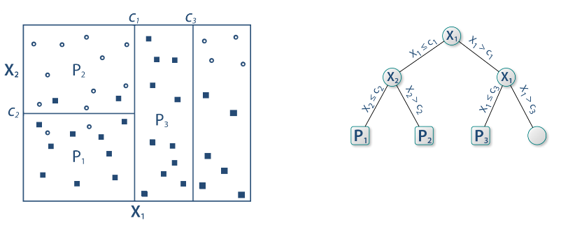
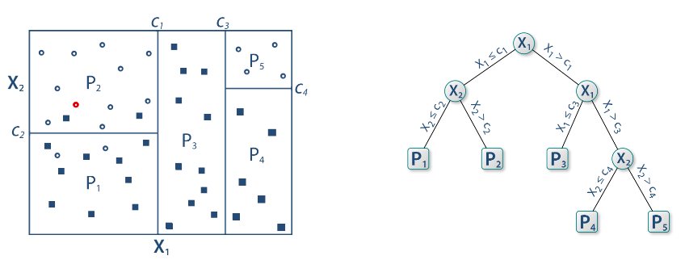

```{r include=FALSE}
library(tidyverse)
library(countdown)

knitr::opts_chunk$set(message = FALSE, warning = FALSE, fig.width = 12, fig.height = 6)
```


https://xkcd.com/1838/

---

# Narzędzia

- [SAS Viya](https://www.sas.com/pl_pl/software/viya.html)

- [RapidMiner Studio](https://rapidminer.com/products/studio/)

- [Orange Data Mining](https://orange.biolab.si/)

- [R](https://www.r-project.org/) i [RStudio](https://rstudio.com/)

- [Python](https://www.anaconda.com/products/individual): [scikit-learn](https://scikit-learn.org/stable/index.html)

???

Jakie informacje (miary) przedstawia krzywa ROC?
Jaka jest główna idea metody grupowania k-średnich?
Wskaż różnice pomiędzy zbiorem treningowym a testowym
W jaki sposób można wykorzystać narzędzia data mining do optymalizacji kosztów w przedsiębiorstwie?

---

# Podział metod

Uczenie nadzorowane - końcowy wynik jest znany

- regresja

- klasyfikacja

Uczenie nienadzorowane - końcowy wynik nie jest znany

- grupowanie obiektów

- grupowanie cech

---

# Podział metod


---


https://twitter.com/computerfact/status/974364686685794304

---

# Klasyfikacja

- binarna (binary) - tylko dwa warianty: zachorowanie, spłata kredytu

- wieloklasowa (multiclass) - typ klienta

- wieloetykietowa (multilabel) - gatunek filmu

[A visual introduction to machine learning](http://www.r2d3.us/visual-intro-to-machine-learning-part-1/)

[Model Tuning and the Bias-Variance Tradeoff](http://www.r2d3.us/visual-intro-to-machine-learning-part-2/)

---

# Podział danych

- dane uczące (treningowe) - zbiór przykładów używanych do dopasowania parametrów algorytmu

- dane testowe - niezależny od danych uczących zbiór przykładów o takim samym rozkładzie jak dane uczące

- dane walidacyjne - zbiór przykładów używanych do dopasowania hiperparametrów 

Często nazewnictwo danych testowych i walidacyjnych jest mylone.

[Wikipedia](https://en.wikipedia.org/wiki/Training%2C_validation%2C_and_test_sets)

---

# Przykład

Zbiór PVA - dane o donacjach dla weteranów. 

Organizacja weteranów poszukuje sposobu, aby lepiej pozyskiwać fundusze od darczyńców. Wysyłając upominki tylko do osób, od których szansa uzyskania donacji jest największa można w znaczący sposób ograniczyć koszty kampanii.

Podstawą jest baza zawierająca informacje o adresach do których wysłano kartkę wraz z informacją czy przełożyło się to na późniejszą donację.

[KDD Cup 1998 Data](https://kdd.ics.uci.edu/databases/kddcup98/kddcup98.html)


---

# Eksploracyjna analiza danych

Explanatory Data Analysis (EDA):

- opis

- wizualizacja

- badanie bez zakładania hipotez badawczych

---

# Przykład

Wizualizacja zmiennych: Age i Target Gift Flag

---

class: inverse

# Zadanie

Przeanalizuj rozkład cechy Median Icnome Region.

1. Co jest niezwykłego w rozkładzie tej cechy?

2. Jaka może być przyczyna występowania anomalii?

3. Co można zrobić w celu sprostowania sytuacji?

---

# Główne problemy

- dane niezbalansowane - w idealnym przypadku klasyfikacji, przypadków z każdej grupy powinno być tyle samo. W przeciwnym przypadku model będzie działał lepiej dla klasy większościowej. Najprostszą metodą balansowania danych jest upsampling czyli dolosowywanie obserwacji z klasy mniejszościowej, tak aby wyrównać liczebności (lub w drugę stronę - downsampling). Alternatywnie można zastosować metodę SMOTE, która generuje sztuczne obserwacje dla klasy mniejszościowej. 

- braki danych - niektóre algorytmy klasyfikacji nie obsługują braków danych. Usunięcie tych obserwacji spowodowałoby znaczne zmniejszenie próby badawczej, zatem stosuje się metody mające na celu uzupełnienie braków danych. W najprostszym przypadku braki można zastąpić średnią/medianą lub dominantą. Do bardziej zaawansowanych należy metoda najbliższych sąsiadów albo imputacja wielokrotna.

---

# Dane PVA

W oryginalnych danych wskaźnik donacji wynosił około 5%. Na potrzeby przykładu zbiór danych został zbalansowany.

---

# Algorytmy

- regresja logistyczna: wymaga spełnienia założeń

- drzewa decyzyjne: łatwa interpretacja

- metody nieparametryczne: mało efektywne dla dużych zbiorów

- metody czarnej skrzynki: SVM, sieci neuronowe, gradient

---

# Złożoność modelu


---

# Złożoność modelu


---

<iframe src="https://embed.polleverywhere.com/multiple_choice_polls/A780edjleaOYLda2mxC6w?controls=none&short_poll=true" width="100%" height="100%" frameBorder="0"></iframe>

---

# Przekształcanie cech wejściowych

- logarytm

- pierwiastek kwadratowy

- standaryzacja


---

# Drzewa decyzyjne


[Źródło](https://github.com/WhyR2019/presentations/blob/master/Keynotes/Marvin_Wright_RF.pdf)

---

# Drzewa decyzyjne


---

# Drzewa decyzyjne


---

# Drzewa decyzyjne



---

# Drzewa decyzyjne


---

# Drzewa decyzyjne


---

# Drzewa decyzyjne



---

# SVM - maszyna wektorów nośnych


---

# SVM - maszyna wektorów nośnych


---

# Sieci neuronowe


---

# Boosting gradientowy


---

# Macierz pomyłek (confusion matrix)


[Źródło](https://pl.wikipedia.org/wiki/Tablica_pomy%C5%82ek)

---

# Miary

Wyniki klasyfikacji można oceniać za pomocą wielu miar:

- Dokładność (accuracy): % poprawnie zaklasyfikowanych

- Precyzja (precison): % poprawnie rozpoznanych przypadków pozytywnych TP/(TP+FP)

- Czułość (sensitivity/recall): % prawdziwie pozytywnych TP/(TP+FN)

- Swoistość (specificity): % prawdziwie negatywnych TN/(TN+FP)

- F1: średnia harmoniczna z czułości i precyzji 2TP/(2TP+FP+FN)

---

# Walidacja krzyżowa


[Źródło](https://ubc-dsci.github.io/introduction-to-datascience/)

---

# Tuning hiperparametrów

Domyślne parametry modelu nie muszą dawać najlepszych rezultatów. W celu ulepszenia klasyfikatora stosuje się metody przeszukiwania parametrów. 

- learning rate

- max depth

- number of trees

- sample rate

Można przeszukiwać całą przestrzeń paramterów (intensywne obliczeniowo) albo losowo.

---

# Objaśnianie modelu

- Ważność cech - jak bardzo model wykorzystuje daną cechę do predycji.

- Wykresy zależności cząstkowych - jak zmienia się prawdopodobieństwo klasyfikacji w zależności od predyktora.

[Explanatory Model Analysis](https://pbiecek.github.io/ema/)

[Interpretable Machine Learning](https://christophm.github.io/interpretable-ml-book/)

---

# Symulacja wyniku biznesowego

- średnia kwota donacji: 15$

- koszt wysłania upominku: 3$

---

# Krzywa LIFT

- pokazuje zysk z zastosowania badanego klasyfikatora względem klasyfikatora losowego

- interpretacja: stężenie obserwacji pozytywnych wśród pierwszych x% obserwacji np. wysłanie upominków do pierwszych 20% darczyńców 2-krotnie zwiększa szansę na pozytywną reakcję

---

# Krzywa ROC

Krzywa ROC to jeden ze sposobów wizualizacji jakości klasyfikacji, pokazujący zależności wskaźników TPR (True Positive Rate) oraz FPR (False Positive Rate).

1. obliczamy prawdopodobieństwo klasyfikacji do danej klasy

2. testujemy wiele progów prawdopodobieństwa (domyślnie 0,5)

3. dla każdego progu obliczamy macierz pomyłek

Pole pod krzywą ROC - AUC (Area under curve) jest jedną z miar jakości klasyfikacji. AUC = 1 (klasyfikator idealny), AUC = 0.5 (klasyfikator losowy), AUC < 0.5 (klasyfikator gorszy od losowego)

Współczynnik Giniego: 2AUC-1. GC = 1 (klasyfikator idealny), GC = 0 (klasyfikator losowy)

[Źródło](https://algolytics.pl/tutorial-jak-ocenic-jakosc-i-poprawnosc-modeli-klasyfikacyjnych-czesc-4-krzywa-roc/)


---

class: inverse

# Zadanie

Na podstawie zbioru BIGORGANICS przeprowadź analizę predykcyjną. 

---

class: inverse, center, middle

# Pytania?