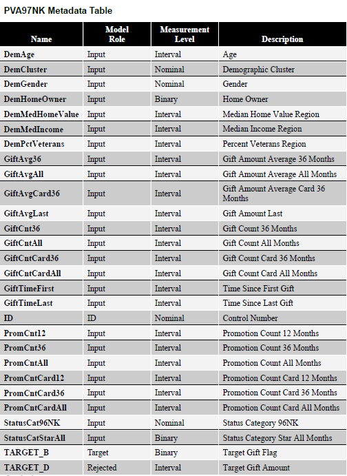
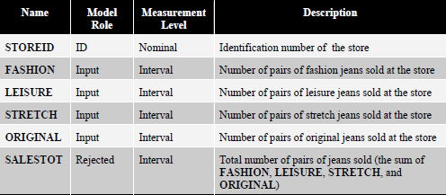

[A visual introduction to machine learning](http://www.r2d3.us/visual-intro-to-machine-learning-part-1/)

[Model Tuning and the Bias-Variance Tradeoff](http://www.r2d3.us/visual-intro-to-machine-learning-part-2/)

## Klasyfikacja

### Zbiory danych

1. [Dataset of homes in San Francisco and New York](data/sf_ny_homes.csv)

  - in_sf - budynek znajduje się w San Francisco
  - beds - liczba sypialni
  - bath - liczba łazienek
  - price - cena
  - year_built - rok budowy
  - sqft - powierzchnia 
  - price_per_sqft - cena za stopę kwadratową
  - elevation - wysokość nad poziomem morza

2. [Social Network Ads](data/Social_Network_Ads.csv)

  - User ID - identyfikator użytkownika
  - Gender - płeć
  - Age - wiek
  - EstimatedSalary - pensja
  - Purchased - dokonał zakupu

3. [Paralyzed Veterans Mail Campaign](data/pva97nk.sas7bdat) Info: [KDD Cup 1998 Data](https://kdd.ics.uci.edu/databases/kddcup98/kddcup98.html)

4. [Synthetic Financial Datasets For Fraud Detection](https://goo.gl/4PXWW9) Info: [Kaggle](https://www.kaggle.com/ntnu-testimon/paysim1)

  - step – jednostka czasu
  - type – typ transakcji
  - amount – kwota transakcji
  - nameOrig – id klienta rozpoczynającego transakcję
  - oldbalanceOrg – saldo przed transakcją
  - newbalanceOrg – saldo po transakcji
  - nameDest – id odbiorcy transakcji
  - oldbalanceDest – saldo przed transakcją
  - newbalanceDest – saldo po transakcji
  - isFraud – transakcja jest oszustwem
  - isFlaggedFraud – oznaczenie oszustwa przez prosty model

## Grupowanie

### Zbiory danych

1. [Klienci](data/klienci.csv)

- klientID - identyfikator klienta
- plec - płeć
- wiek - wiek
- roczny_dochod - roczny dochód wyrażony w tys. dolarów
- wskaznik_wydatkow - klasyfikacja sklepu od 1 do 100

2. [Census2000](data/census2000.sas7bdat)

- ID - kod pocztowy regionu
- LOCX - długość geograficzna
- LOCY - szerokość geograficzna
- MEANHHSZ - średnia wielkość gospodarstwa domowego w regionie
- MEDHHINC - mediana dochodu gospodarstwa domowego w regionie
- REGDENS - percentyl gęstości zaludnienia (1 - najniższy percentyl, 100 - najwyższy percentyl)
- REGPOP - populacja w regionie

3. [Sprzedaż spodni roboczych](data/dungaree.sas7bdat)

4. [Credit Card Dataset](data/credit_cards.csv) Info: [Kaggle](https://www.kaggle.com/arjunbhasin2013/ccdata)

- CUST_ID : Identification of Credit Card holder (Categorical) 
- BALANCE : Balance amount left in their account to make purchases 
- BALANCE_FREQUENCY : How frequently the Balance is updated, score between 0 and 1 (1 = frequently updated, 0 = not frequently updated)
- PURCHASES : Amount of purchases made from account 
- ONEOFF_PURCHASES : Maximum purchase amount done in one-go 
- INSTALLMENTS_PURCHASES : Amount of purchase done in installment 
- CASH_ADVANCE : Cash in advance given by the user 
- PURCHASES_FREQUENCY : How frequently the Purchases are being made, score between 0 and 1 (1 = frequently purchased, 0 = not frequently purchased)
- ONEOFFPURCHASESFREQUENCY : How frequently Purchases are happening in one-go (1 = frequently purchased, 0 = not frequently purchased) 
- PURCHASESINSTALLMENTSFREQUENCY : How frequently purchases in installments are being done (1 = frequently done, 0 = not frequently done) 
- CASHADVANCEFREQUENCY : How frequently the cash in advance being paid 
- CASHADVANCETRX : Number of Transactions made with "Cash in Advanced" 
- PURCHASES_TRX : Numbe of purchase transactions made 
- CREDIT_LIMIT : Limit of Credit Card for user
- PAYMENTS : Amount of Payment done by user
- MINIMUM_PAYMENTS : Minimum amount of payments made by user 
- PRCFULLPAYMENT : Percent of full payment paid by user 
- TENURE : Tenure of credit card service for user

## Prognozowanie

### Zbiory danych

1. [Jakość powietrza w Polsce](data/pyly_wawa.xlsx)

- czas - data
- pm25 - poziom PM2.5 ($\mu g$)
- pm10 - poziom PM10 ($\mu g$)

2. [Pogoda w Polsce](data/pogoda_wawa.csv)

- czas - data
- temp - temperatura ($^{\circ}$C)
- wilgotnosc - wilgotność (%)
- wiatr - prędkość wiatru (m/s)
- chmury - pokrycie nieba przez chmury (oktanty)

3. [Beijing PM2.5](data/PRSA_data.csv) Info: [UCI MLR](http://archive.ics.uci.edu/ml/datasets/Beijing+PM2.5+Data)

- No: row number 
- year: year of data in this row 
- month: month of data in this row 
- day: day of data in this row 
- hour: hour of data in this row 
- pm2.5: PM2.5 concentration ($\mu g/m^3$) 
- DEWP: Dew Point 
- TEMP: Temperature
- PRES: Pressure (hPa) 
- cbwd: Combined wind direction 
- Iws: Cumulated wind speed (m/s) 
- Is: Cumulated hours of snow 
- Ir: Cumulated hours of rain 